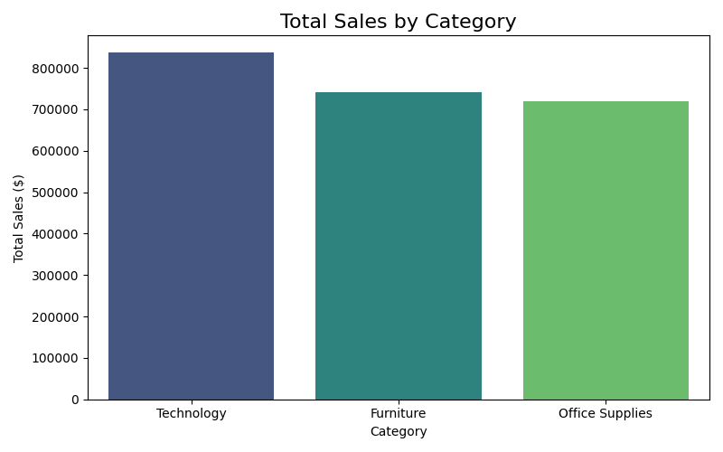
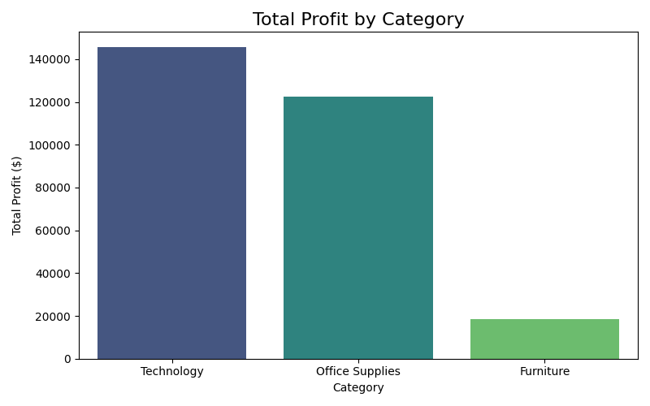
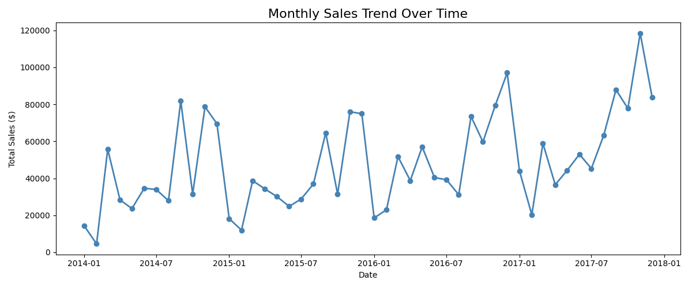
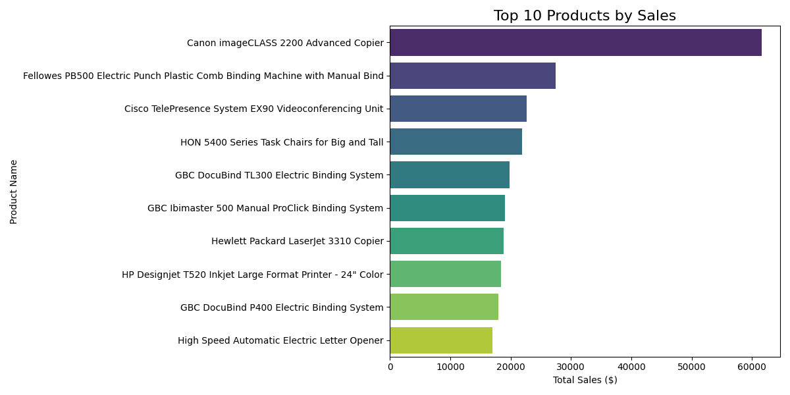
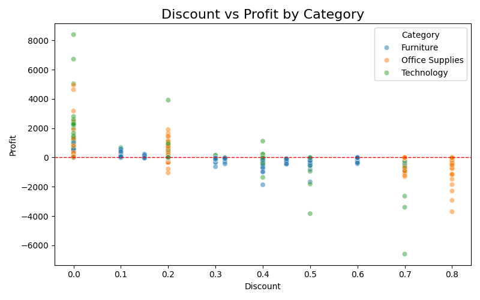

# 📊 Business Sales Performance Analytics
### Future Interns — Data Science & Analytics Track | Task 1

## 📌 Project overview
This project analyzes 4 years of business sales data (2014–2017) for a retail company 
across the US. The goal was to identify revenue trends, top-selling products, 
high-value categories, and regional performance and turn that into actionable 
business recommendations.

## 🛠️ Tools used
- Python (Pandas, Matplotlib, Seaborn)
- Jupyter Notebook

## 📁 Dataset
Superstore Sales Dataset -> 9,994 transactions across 4 years
Source: Kaggle

## 📈 Key findings
- Total revenue: $2,297,200.86 | Profit margin: 12.47%
- Technology is the highest revenue AND profit category
- Furniture sells well but barely generates profit due to heavy discounting
- Discounts above 40% consistently result in negative profit (losses)
- West region leads in both sales and profit
- Sales show a clear upward trend with Q4 spikes every year

## 💡 Recommendations
1. Cap discounts at 30% —> anything above is losing money
2. Review Furniture pricing strategy urgently
3. Double down on Technology products
4. Target growth efforts toward South and Central regions
5. Plan marketing campaigns around Q4 peak season

## 📊 Visualizations

